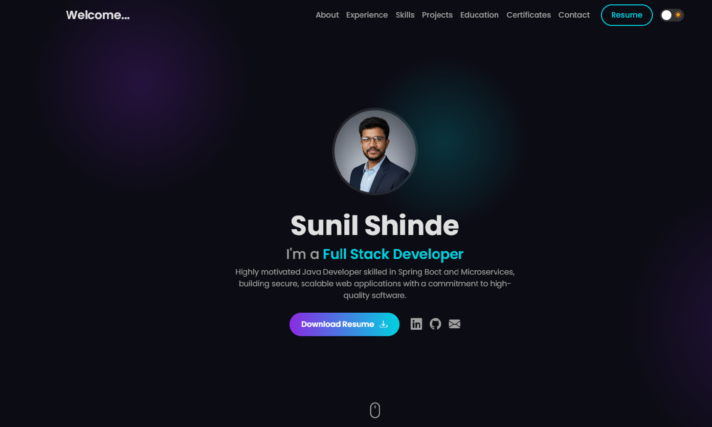

<div align="center">
  
  <h1><b>Sunil Shinde | Java Developer Portfolio</b></h1>
  <p>An interactive and animated personal portfolio built with modern web technologies, featuring a dual-theme system, 3D effects, and a custom cursor experience.</p>
</div>

<div align="center">

[](https://www.java.com/)
[](https://spring.io/)
[](https://developer.mozilla.org/en-US/docs/Web/Guide/HTML/HTML5)
[](https://www.w3.org/Style/CSS/Overview.en.html)
[](https://developer.mozilla.org/en-US/docs/Web/JavaScript)
[](https://getbootstrap.com/)
</div>

---

## 🚀 Live Demo

### [**Click Here to Explore the Live Portfolio**](https://s3portfolio.netlify.app/)

<div align="center">
  <a href="https://s3portfolio.netlify.app/" target="_blank">
    
  </a>
  <br/>
  <i>(Tip: Record a short GIF showcasing the theme switcher, custom cursor, and scroll animations to place here!)</i>
</div>

---

## 🌟 About This Project

> This portfolio is more than just a digital resume; it's a testament to my passion for development and my belief in creating memorable user experiences. It was built from the ground up to be an interactive playground, blending a modern "Glassmorphism" aesthetic with fluid animations and user-centric features. The goal was to build a professional platform that not only lists my skills but actively demonstrates my attention to detail and technical capabilities.

---

## ✨ Core Features

This portfolio is packed with modern and interactive features designed to create an engaging experience:

*   **🎨 Dual-Theme System:** A sleek theme switcher allows users to toggle between a glowing **Dark Mode** and a crisp, professional **Light Mode**. The user's preference is automatically saved in their browser for future visits.
*   **🖱️ Custom Interactive Cursor:** A bespoke cursor provides instant visual feedback, transforming its appearance when hovering over links, buttons, and other interactive elements.
*   **✨ Interactive 3D Skill Cards:** Skill cards feature a subtle 3D parallax tilt effect (**Vanilla-Tilt.js**), making the skills section more dynamic and fun to explore.
*   **✒️ Dual Typing Animations:**
    *   A welcoming animation in the navbar cycles through multilingual greetings before settling on my name.
    *   A dynamic title effect in the hero section showcases my different roles and specializations.
*   **🚀 Smooth Scroll-Reveal Animations:** Every section gracefully fades and slides into view as the user scrolls, creating a smooth, narrative-driven browsing experience.
*   **📈 Animated Timelines:** The timeline's connecting line animates as it enters the viewport, visually guiding the user through my professional and educational journey.
*   **📱 Meticulously Responsive Design:** The layout is crafted to ensure a flawless and intuitive experience on all devices, from mobile phones to high-resolution desktops.

---

## 🛠️ My Tech Stack

This project was built using a combination of foundational and modern technologies.

| Category               | Technologies & Tools                                                                                                      |
| ---------------------- | ------------------------------------------------------------------------------------------------------------------------- |
| **Backend Focus**      | `Java`, `Spring Boot`, `Hibernate`, `Microservices`                                                                         |
| **Frontend**           | `HTML5`, `CSS3 (Flexbox, Grid)`, `JavaScript (ES6+)`, `Bootstrap 5`                                                          |
| **Databases**          | `MySQL`, `MongoDB`                                                                                                        |
| **JavaScript Library** | `Vanilla-Tilt.js` (for 3D effects)                                                                                        |
| **DevOps & Tools**     | `Git`, `GitHub`, `VS Code`, `Netlify (CI/CD & Hosting)`                                                                      |

---

## 🚀 Getting Started (Local Setup)

To explore and run this project on your local machine, follow these simple steps:

1.  **Clone the repository:**
    ```sh
    git clone https://github.com/sunilshinde1319/SunilShinde_Portfolio.git
    ```

2.  **Navigate into the project directory:**
    ```sh
    cd SunilShinde_Portfolio
    ```

3.  **Run the project:**
    *   Simply open the `index.html` file in your favorite web browser.
    *   For the best development experience, I recommend using the **Live Server** extension in VS Code, which provides live reloading.

---

## 📫 Let's Connect!

I'm always excited to connect with fellow developers, tech enthusiasts, and potential collaborators. If you have any questions, want to discuss a project, or just want to say hi, feel free to reach out!

<div align="center">

[](https://linkedin.com/in/s2001)
[](https://github.com/sunilshinde1319)
[](mailto:sunilshinde5699@gmail.com)

</div>

---

## 📜 License

This project is licensed under the **MIT License**. See the `LICENSE` file for more details.
